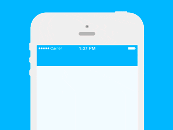
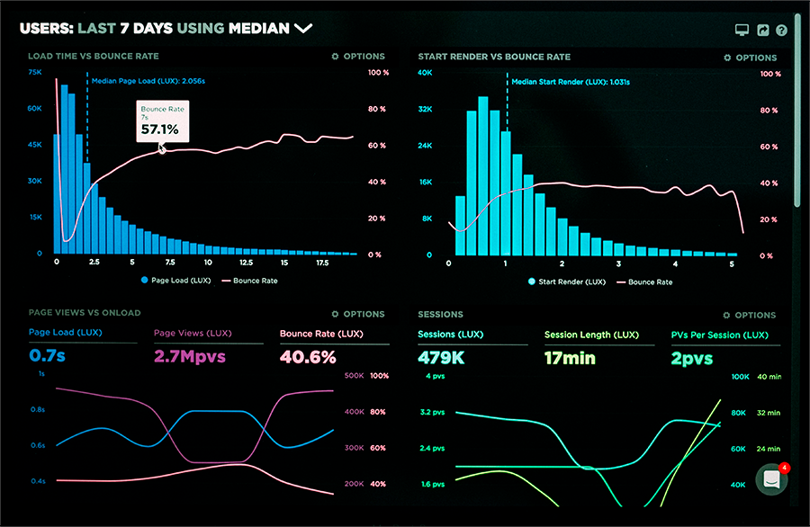

***Note** - Add a project logo or a banner - You can use [Canva](https://www.canva.com) to make your own logo and make it look more professional,  or you can pay a few dollars for logo at [Fiverr](https://www.fiverr.com) or similar alternative.

# Public-README-Sample
This repository is an example for a good public repository README page.
One of the most crucial things in your open source project is the README.md file, make your repository look good, useful, easy to understand and use.

***Note** - There is a difference between the 'Read me' page of your public repository and the private one, according to the monetization path you've chose.
For example, if you choose the 'Dual Licens' model, you should write in your public (GPL copyleft) license repository what extra features can be found in the private MIT license at [xs:code](https://cp.xscode.com/repositories/8) and of course add a link to it,
another example, if you chose the 'Open Core - Freemium' model, you should also attach a link and  write in the public repository the maintanance and support offers for the Pro version.

## Static Code Analysis

Make it easy for users to see the project progress and many other indicators,
Check out [Shields.io](https://Shields.io) to use or make your own badges:


## Demo / Demo GIF
Make a GIF with any GIF maker / screen recorder and show users how this project works.



> *via @Beedigital.net on [GIPHY](https://media.giphy.com/media/sM7c9dEXTQlEc/source.gif)*

Check out the [Demo](https://xscode.com) (Add a real link to your demo version)

## Table of Contents
You can include a table of contents in order to allow other developers to navigate

(especially if you have a long and detailed README).


<!--ts-->
* [Public-README-Sample](#public-reademe-sample)
* [Prerequisites](#prerequisites)
* [Installation](#installation)
* [Initial Configuration](#initial_configuration)
* [Usage](#usage)
* [Built With](#built_with)
* [Documentaion](#documentaion)
* [What's Included? (Features)](#what's_included? (features))
* [Configuration](#configuration)
* [Contributing](#contributing)
* [Links](#links)
* [Support & Maintenance](#support_&_maintenance)
* [Licensing](#licensing)
<!--te-->
***Note** - The table of contents is **Optionally**.


## Prerequisites
Here you should say what prerequisites you need to have in order to use the project.

### System Requirements:
* [Ruby](http://www.ruby-lang.org/en/) >= 2.2.5
* [Rubygems](https://rubygems.org) >= 2.5.4
* [Rails](http://rubyonrails.org) > 4.3
* [git](https://git-scm.com) >= 2.24.0


## Installation
Step by step instullation explanation, or a quick introduction of the minimal setup you need to get a hello world up &
running.

```shell
packagemanager install Public-README-Sample
Public-README-Sample start
Public-README-Samplet "Help mw promote my repo!"  # prints "YES."
```
Here you should say what actually happens when you execute the code above.

### Initial Configuration

Some projects require initial configuration (e.g. access tokens or keys, `npm i`).
This is the section where you would document those requirements.

### Usage
Instruct developers on how to use your project after they’ve installed it.
This would also be a good place to include screenshots of your project in action.



## Running tests
Explain how to run the automated tests for this project

```
Tests example
```

## Built With

* [AngularJS](https://angularjs.org) - The web framework used
* [Maven](https://maven.apache.org/) - Dependency Management
* [FetchRSS](http://fetchrss.com) - Used to generate RSS Feeds

If your project needs some additional steps for the developer to build the
project after some code changes, state them here:

```shell
./configure
make
make install
```

## Documentaion
Here add a link to your Documentation file.
it's very important to have a well and updated documentation of your project.
Check out this great and easy documentaion tool - [docusaurus.io](https://docusaurus.io/) 


## What's Included? (Features)
Here add a list of the features included in the project.

* The main functionality of this project
* Does another thing
* Also do this - Available only in the license version at xs:code
* And more - Available only in the license version at xs:code

***Note** - Some features are only available in the Premmisive license version at [xs:code](https://xscode.com)

## Configuration

Here you should write what are all of the configurations a user can enter when
using the project.

#### Argument 1
Type: `String`  
Default: `'default value'`

#### Argument 2
Type: `Number|Boolean`  
Default: 120

State what the argument does and how you can use it. If needed, provide
an example.

Example:
```bash
Public-README-Sample "Some other value"  # Prints "Starting to look like a great README!"
```

## Contributing
Contributions are always welcome!
If you'd like to contribute, please read our [**contributors guidelines**](https://github.com/DekelKan/Public-README-Sample/blob/master/CONTRIBUTING.md), fork the repository and use a feature
branch.

***Note** - Add a link to 'CONTRIBUTING.md' file for deatils on your code of conduct, and the process for submitting pull requests to you.

## Links

Even though this information can be found inside the project on machine-readable
format like in a .json file, it's good to include a summary of most useful
links to developers that are using your project. You can include links like:

- Project homepage: https://xscode.com/
- Repository: https://github.com/xscode-com/Public-README-Sample
- Issue tracker: https://github.com/xscode-com/Public-README-Sample/issues

***Note** - In case of sensitive bugs like security vulnerabilities, please contact
    support@xscode.com directly instead of using issue tracker.
    We value your effort to improve the security of this project!
    
- Related projects:
  - A link to the Premmisive MIT license version of this project: https://cp.xscode.com/repositories/8
  
 ## Support & Maintenance
  ***Note** -  Support & Maintenance are only available in the Premmisive MIT license version at [xs:code](https://cp.xscode.com/repositories/8)
  
 ## Contributors
 A Huge thank you to all our contributors for the maintaining and support  this project.
 Keep on making it better!
   
<!-- ALL-CONTRIBUTORS-LIST:START - Do not remove or modify this section -->
<!-- prettier-ignore -->
<table>
  <tr>
      <td align="center"><a href="https://github.com/DekelKan"><br /><sub><b>Dekel Kan</b></sub></a><br /><a href="https://github.com/DekelKan/a.all-contributorsrc/commits?author=DekelKan" title="Code">💻</a> 
     <td align="center"><a href="https://github.com/chenravid-xs"><br /><sub><b>Chen Ravid</b></sub></a><br /><a href="https://github.com/DekelKan/a.all-contributorsrc/commits?author=DekelKan" title="Code">💻</a> 
    <td align="center"><a href="https://github.com/nmohoni"><br /><sub><b>Netnael Mohoni</b></sub></a><br /><a href="https://github.com/DekelKan/a.all-contributorsrc/commits?author=DekelKan" title="Code">💻</a>
         <td align="center"><a href="https://twitter.com/Helad11"><br /><sub><b>Elad Adir</b></sub></a><br /><a href="https://github.com/DekelKan/a.all-contributorsrc/commits?author=DekelKan" title="Code">💻</a>
  </tr>
</table>

 ***Note** - You can also use the [Emoji Key](https://allcontributors.org/docs/en/emoji-key) and [all-contributors bot](https://allcontributors.org/docs/en/bot/overview) to automate acknowledging contributors to your projects.
  
 ## Autor
 This repository made with :blue_heart: by xs:code

 ## Licensing
 This project is licensed under the [GPL-3.0 license](https://github.com/DekelKan/Public-README-Sample/blob/master/LICENSE).
